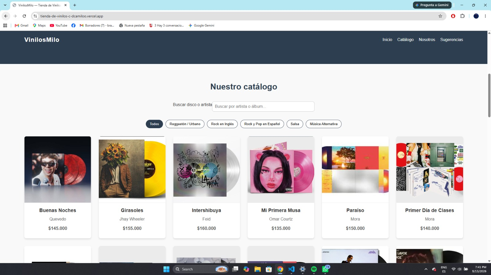

# TiendaDeVinilosCDcamiloo
Este proyecto se tomara en el marco del desarrollo de una pagina web enfocada,En una tienda virtual de Vinilos y CDS, dirigida hacia un publico amante a la musica en formatos fisicos,resolviendo el problema de poder encontrar discos y estos otros medios en una epoca tan digital como es esta.

## link a vercel con la aplicacion
https://tienda-de-vinilos-c-dcamiloo.vercel.app/#inicio

## Capturas de Pantalla

### Vista de Escritorio

### Vista Móvil

### 3. Uso de Inteligencia Artificial
Usé la ia como apoyo para entender reglas específicas de CSS Grid (como auto-fit y minmax) y para validar que mi jerarquía de etiquetas semánticas fuera correcta. Sin embargo, los nombres de clases, la estructura de mi arreglo de discos y la lógica de búsqueda las escribí y ajusté yo mismo según cómo quería que se comportara mi catálogo específico.

### 4. Retos del Desarrollo
El mayor reto fue que la búsqueda sobrescribía los datos originales del catálogo. Lo resolví separando el renderizado en una función "renderizarDiscos(discos)" que recibe un arreglo filtrado, sin tocar el arreglo original.

### 5 JavaScript y validación

Mi JavaScript hace cinco cosas principales: muestra un disco aleatorio destacado al cargar la página, genera todas las tarjetas del catálogo dinámicamente a partir de un arreglo de objetos (no están escritas a mano en el HTML), filtra ese catálogo por género cuando el usuario hace clic en un botón, filtra en tiempo real mientras el usuario escribe en el buscador, y valida el formulario de sugerencias antes de "enviarlo".

La validación funciona así: cuando el usuario hace submit, bloqueo el envío por defecto del navegador y reviso cada campo por separado. El nombre necesita al menos 3 letras, el email se valida con una expresión regular que verifica que tenga el formato usuario@dominio.algo, y el álbum sugerido necesita al menos 5 caracteres. Si un campo falla, escribo el mensaje de error directamente en el  que está justo debajo de ese input, en vez de usar alert(). Si todos los campos pasan, muestro un mensaje de éxito y limpio el formulario.

### Flexbox y Grid

Usé Flexbox en el header (para alinear el logo y el menú), en los botones de filtro, en los campos del formulario y en el footer — en general, en cualquier parte donde los elementos van en una sola fila o columna. Usé Grid solo en el catálogo de discos, porque ahí necesitaba una cuadrícula real de tarjetas que cambiara de columnas según el ancho de pantalla. Con grid-template-columns: repeat(auto-fit, minmax(250px, 1fr)) el navegador calcula solo cuántas columnas caben, sin que yo tenga que escribir media queries distintas para cada tamaño.